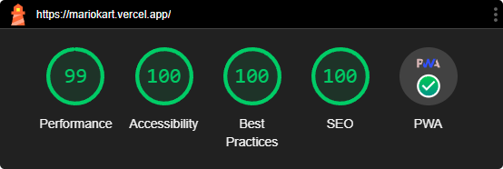
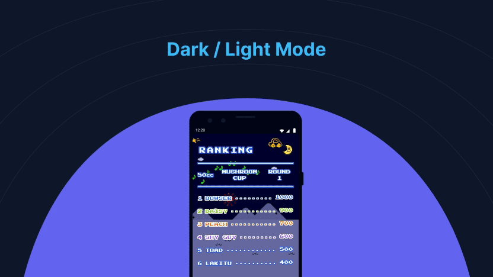
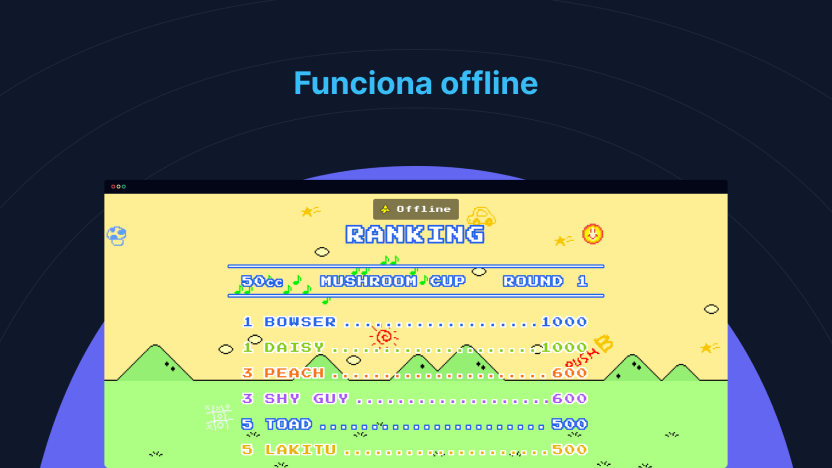
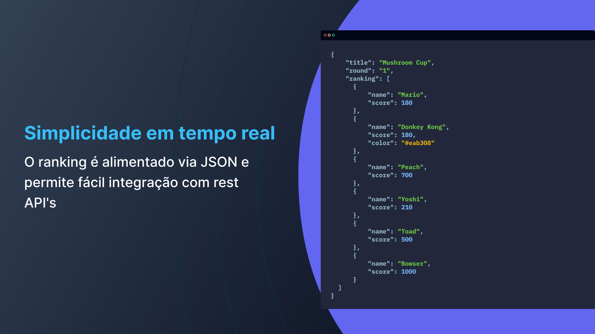

<h1 align="center">
    
    
Mario Kart Ranking

</h1>

    <i align="center">HTML5, responsivo e dinâmico 🚀</i>

<!-- 
Veja o site: <a href="https://mariokart.vercel.app">mariokart.vercel.app</a>
 -->

## Sobre

- **[Acesse o Site ⤴](https://mariokart.vercel.app)**
- **[Lighthouse](#lighthouse)**
- **[Tema claro/escuro](#temas-claro-e-escuro)**
- **[PWA](#pwa)** o site funciona como um app e pode ser acessado mesmo offline
- **[Dados dinâmicos](#dados-dinamicos)**
- **[Copyright](#copyright)**

## Lighthouse

    

## Temas claro e escuro

    

## PWA

O ranking conta com um service worker que armazena os assets do projeto em cache e permite o funcionamento do site mesmo quando não há internet. Quando reestabelecida a conexão, o site é atualizado.

    

## Dados Dinâmicos

    

## Curtiu o projeto?

Considere dar uma estrela ⭐.

### Precisa de um dev front-end?

**[Pode conferir meu currículo por aqui](https://bit.ly/3h1Qewn)**.

## Copyright

Este projeto é um clone do ranking do jogo Super Mario Kart para o SNES e foi criado para fins educacionais e não comerciais.

O autor deste projeto não detém os direitos sobre o jogo Super Mario Kart, o sistema SNES ou qualquer propriedade associada. Todos os direitos autorais e marcas comerciais são propriedade de seus respectivos proprietários.

Super Mario Kart e SNES são marcas registradas da Nintendo. Este projeto não é endossado, patrocinado ou afiliado à Nintendo ou a qualquer de suas subsidiárias ou afiliadas (infelizmente).

Se você é o proprietário dos direitos autorais e acredita que este projeto viola seus direitos, entre em contato.
